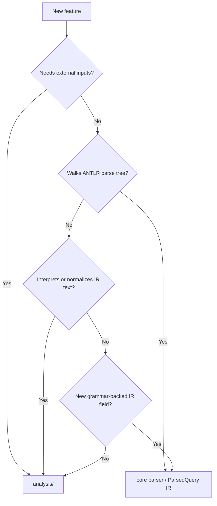

# Architecture Decision Guide: Core Parser vs Analysis Layer

Where does a new feature belong? Use this guide when deciding.

- **Core parser** (`postgresparser` root) — SQL text in, `ParsedQuery` IR out. Walks ANTLR parse tree nodes. No external inputs.
  Key files: `entry.go`, `ir.go`, `select.go`, `dml_*.go`, `ddl.go`, `merge.go`, `setops.go`

- **Analysis layer** (`analysis/`) — operates on `*ParsedQuery` + optional external metadata (`ColumnSchema`). Interprets, composes, enriches.
  Key files: `analysis/analysis.go`, `analysis/types.go`, `analysis/where_conditions.go`, `analysis/join_parser.go`, `analysis/combined_extractor.go`, `analysis/helpers.go`

## Decision Flowchart

```
New feature or enhancement
|
+- Does it require external inputs beyond SQL text?
|  (schema metadata, PK info, config, runtime state)
|  YES -> analysis/
|
+- Does it parse/interpret raw string fields from the IR?
|  (extracting operators from WHERE strings, splitting JOIN conditions)
|  YES -> analysis/
|
+- Does it walk ANTLR parse tree nodes (gen.*Context)?
|  YES -> core parser (ddl.go, select.go, dml_*.go, or new file)
|
+- Is it a new IR field that the grammar directly provides?
|  YES -> core parser (ir.go for type, visitor file for extraction)
|
+- Is it a convenience/utility over existing IR fields?
|  YES -> analysis/helpers.go
|
+- None of the above?
   -> Discuss. It's probably analysis/, but worth reviewing.
```

## Visual Guide

### Layer Selection Chart



### API Selection Chart

| Goal | API | Layer |
|---|---|---|
| Parse SQL to raw IR | `postgresparser.ParseSQL*` | Core |
| Analyze query into consumer DTO | `analysis.AnalyzeSQL*` | Analysis |
| Extract structured WHERE constraints | `analysis.ExtractWhereConditions` | Analysis |
| Infer FK-like JOIN relationships with schema metadata | `analysis.ExtractJoinRelationshipsWithSchema` | Analysis |
| One-pass WHERE + JOIN analysis with schema metadata | `analysis.ExtractQueryAnalysisWithSchema` | Analysis |

## Boundary Rules (Short Version)

- **Core parser owns grammar extraction**.
  - If the value comes directly from ANTLR nodes/tokens, it belongs in core IR.
- **Analysis owns interpretation/normalization**.
  - If it derives/normalizes from IR fields (operator normalization, alias resolution, value parsing), it belongs in analysis.
- **Avoid mirrored contracts**.
  - Do not add the same interpreted DTO to both `ir.go` and `analysis/types.go`.
- **Pay-for-what-you-use performance**.
  - Keep heavier interpretation out of `ParseSQL` when it is optional.
  - Put derived logic behind analysis APIs so callers pay only when needed.

## Examples

### Core parser:

| Feature | Why |
|---|---|
| Extract RETURNING clause columns | Direct parse tree extraction |
| Parse window function PARTITION BY | Grammar-level clause, walks `gen.*Context` |
| Add `CONCURRENTLY` flag to DDL | Direct flag from parse tree node |
| Support MERGE statement | New statement type, needs new visitor file |

### Analysis:

| Feature | Why |
|---|---|
| Structured WHERE conditions (operator, value, table) | Interprets raw IR strings |
| FK relationship detection from JOINs | Requires schema metadata (`IsPrimaryKey`) |
| Query complexity scoring | Derived metric from IR fields |
| Missing-WHERE-on-DELETE detection | Semantic rule, not grammar extraction |
| Schema validation (do referenced columns exist?) | Requires external schema metadata |
| `BaseTables()` | Convenience function over IR/DTO |

## Case Study: Why `WhereCondition` Is Analysis-Only

`WhereCondition` should remain in analysis, not duplicated in core IR.

1. Core already exposes raw WHERE facts (`ParsedQuery.Where`, `ParsedQuery.ColumnUsage`).
2. `WhereCondition` is an interpreted projection over IR:
   - operator normalization
   - value/parameter extraction
   - alias-to-table resolution for consumer convenience
3. This logic is policy and can evolve independently from parse-tree extraction.
4. Keeping it in analysis avoids extra work in the core parse fast path for users that only need IR.

## Why WithSchema Methods Stay in Analysis

`ExtractJoinRelationshipsWithSchema` and `ExtractQueryAnalysisWithSchema` accept `map[string][]ColumnSchema` — external metadata the grammar cannot provide. The core parser's contract is "SQL text in, IR out" with no side inputs. These functions require DB metadata, perform semantic inference, and return types with no grammar-level equivalent.

## Common Anti-Patterns

- Adding analysis DTOs to `ir.go` "for convenience".
- Re-implementing the same transformation in both core and analysis.
- Putting schema-dependent logic inside core parser visitors.
